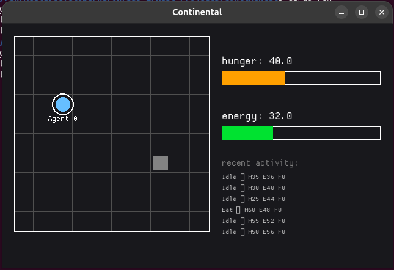

# Continental

Continental is an agent-based colony sim written in Rust. The goal is **not** a playable
game — it's a demonstration that city-level behavior can emerge from individually legible
per-agent decision loops. Every agent's behavior should be explainable from its current
state at any tick.



Each agent runs the same decision loop every tick:

```
sense -> evaluate -> select -> act -> replan
```

Needs (hunger, energy, ...) are plain numbers that decay over time, and priority between
needs/actions is always decided by comparing or scoring those numbers — **never** by
randomness.

## Running

```
cargo run
```

opens a window showing an agent ticking once a second. Click the agent or the house on
the grid to see its details in the side panel. `cargo test` runs the unit tests.

## License

MIT — see [LICENSE](LICENSE).
